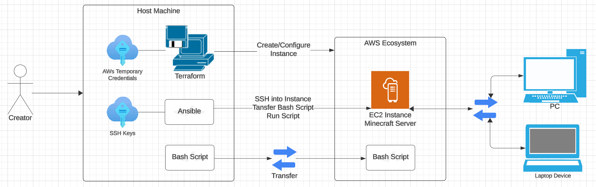

sa# Minecraft Server on AWS with Terraform and Ansible

## Background
This project aims to automate the provisioning, configuration, and setup of a Minecraft server on AWS using Terraform and Ansible. We will create an EC2 instance, configure security settings, and deploy a Minecraft server, all without manual intervention via the AWS console.

## Requirements

### Tools
* __Terraform__ - to provision and manage the AWS infrastucture
* __Ansible__ - to configure the Minecraft server on the EC2 instance
* __AWS CLI__ - to interact with AWS services and manage credentials
* __SSH Key__ - to securely connect to the EC2 instance

### Installation
1. [__Terraform__](https://developer.hashicorp.com/terraform/install)
2. [__Ansible__](https://docs.ansible.com/ansible/latest/installation_guide/installation_distros.html)
3. [__AWS CLI__](https://docs.aws.amazon.com/cli/latest/userguide/getting-started-install.html)

### Configuration
1. __AWS Short-term Credentials__\
a. Select  __AWS Detials__ to navigate to the Cloud Access panel.\
b. Obtian temporary credentials from the Cloud Access panel. You will recieve an Access Key ID, Secret Access Key, and a Session Token.\
c. Copy and paste the credentials into the `~/.aws/credentials` file:
    > `nano ~/.aws/credentials`

    Paste your obtained temporary crendetials:

    > `[default]`\
    > `aws_access_key_id = YOUR_ACCESS_KEY_ID`\
    > `aws_secret_access_key = YOUR_SECRET_ACCESS_KEY`\
    > `aws_session_token = YOUR_SESSION_TOKEN`

    Ensure they your temporary crendetials are valid throughout the duration of the Terraform and Ansible operations.
2. __SSH Key Pair__\
a. If you do not already have an SSH key pair, you can create one using the AWS CLI.

    > `aws ec2 create-key-pair --key-name minecraft-key --query 'KeyMaterial' --output text > ~/.ssh/minecraft-key.pem`
    
    > `chmod 400 ~/.ssh/minecraft-key.pem`

    This command will create a key pair named minecraft-key and save the private key to ~/.ssh/minecraft-key.pem.

    b. Set ansible_ssh_private_key_file variable in `provision.tf` to point to your SSH private key
    > `ansible_ssh_private_key_file=/path/to/your/key.pem`

## Diagram of Major Steps
1. Terraform - provision AWS resources.
    - Create an EC2 instance
    - Allocate and associate an Elastic IP
    - Configure security groups
    - Generate Ansible inventory file
2. Ansible - configure the Minecraft server.
    - Upload and execute a setup script to instal and run the Minecraft server

## Commands to Run
__Terraform__
1. Initialize Terraform
    > `terraform init`

    Initilize the working directory contianing Terraform configuration files.
2. Apply Configuration
    > `terraform apply`

    Provisions the AWS resources. Confirm the changes when prompted.

__Ansible__
1. Run the Ansible Playbook
    > `ansible-playbook -i inventory playbook.yaml`

    Configures the Minecraft server by uploading and executing the setup script.

__Verify the Server__
1. Check that the Minecraft server is running\
After the Ansible playbook has finished running, verify that the Minecraft server is running using nmap. Replace ip_addr with the actual IP address of your server. The IP address will be displayed towards the end of the Terraform and Ansible run.

    > `nmap -sV -Pn -p T:25565 x.x.x.x`

    This command should show that port 25565 is open and that the Minecraft service is running.

below needs verifying

## How to Connect to the Minecraft Server

The public IP address of your Minecraft server will be output by the `terraform apply` and `ansible-playbook -i inventory playbook.yml` command. Alternatively, you can find it in the inventory file generated by Terraform.

To connect, open Minecraft, go to "Multiplayer", click "Add Server", and enter the public IP address of your server.

Enjoy your server with your friends!